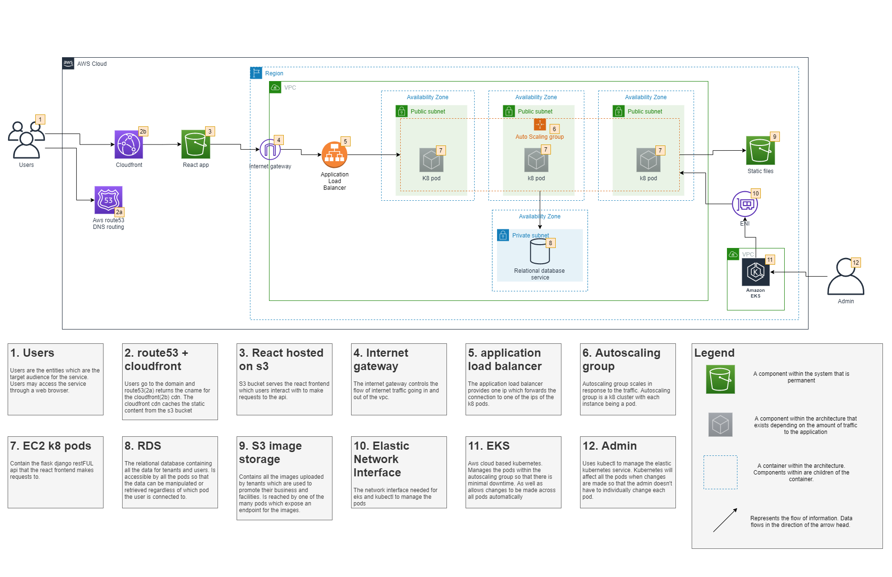

# About the project
A while back one of my educators at CoderAcademy suggested I make an app that makes use of multitenancy to provide anyone the ability to make their own little site. This app will allow anyone to register a subdomain and provide their customers the ability to book their facilities/services from the comfort of their home.

**Purpose:** To provide anyone the ability to set up an intuitive and progressive facility booking web application.

**Functionality/Features:** The web application will make use of multitenancy to allow anyone to create their own domain and serve their customers. The customers will be able to register, login, select a facility they wish to book, select a date from a graphical calendar and a time slot from a graphical timetable. When a booking is made a confirmation email will be mailed to the booker.
Superusers will be able add and remove facilities/members/bookings through the interface.

**Target Audience:** The application will be multipurpose and so the target audience can be virtually anyone with internet connectivity. The application will provide the tools needed so that facility owners can set up their own domains. They and the users that they serve are the target audience.

**Tech stack:** 
- frontend - react
- backend - flask (python) + gunicorn + nginx
- databases - postgresql, S3
- additional - aws, terraform, kubernetes, docker

---
### preview

---
### data flow diagram

---
### application architecture diagram
