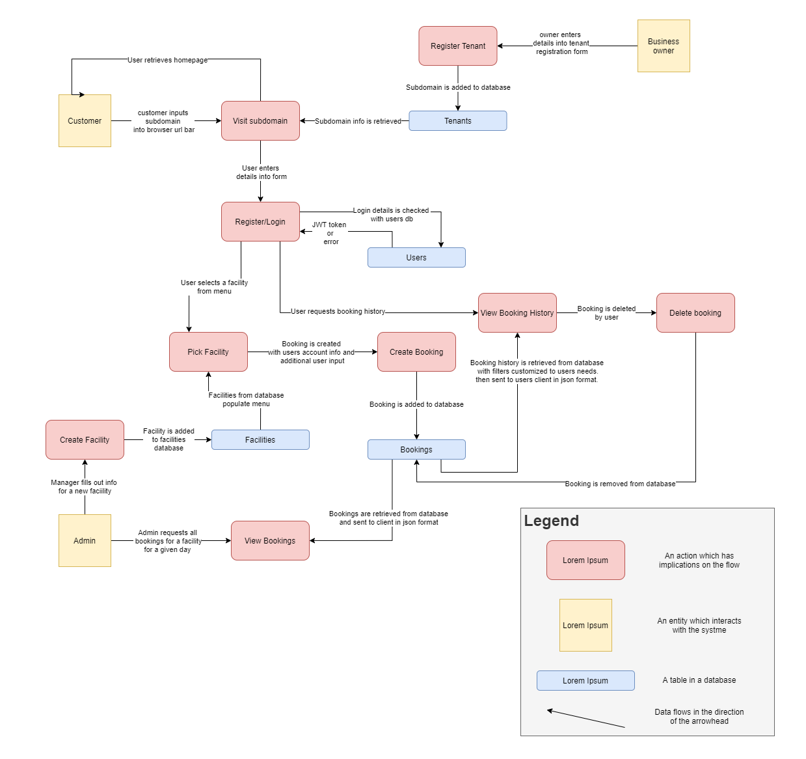

# About the project
A while back one of my educators at CoderAcademy suggested I make an app that makes use of multitenancy to provide anyone the ability to make their own little site. This app will allow anyone to register a subdomain and provide their customers the ability to book their facilities/services from the comfort of their home.

**Purpose:** To provide anyone the ability to set up an intuitive and progressive facility booking web application.

**Functionality/Features:** The web application will make use of multitenancy to allow anyone to create their own domain and serve their customers. The customers will be able to register, login, select a facility they wish to book, select a date from a graphical calendar and a time slot from a graphical timetable. When a booking is made a confirmation email will be mailed to the booker.
Superusers will be able add and remove facilities/members/bookings through the interface.

**Target Audience:** The application will be multipurpose and so the target audience can be virtually anyone with internet connectivity. The application will provide the tools needed so that facility owners can set up their own domains. They and the users that they serve are the target audience.

**Tech stack:** 
- frontend - react
- backend - flask (python) + gunicorn + nginx
- databases - postgresql, S3
- additional - aws, terraform, kubernetes, docker

---
### Preview

---
### Data Flow Diagram

---
### Application Architecture Diagram

### Erd

### Deployment Instructions
**the below instructions refer to a development deployment**
- Change Directory into the rest-api src folder `cd ./rest-api/src`
- Make sure venv is installed then run: `sudo apt-get install python3-venv` 
- Create the virtual environment: `python3 -m venv venv` Activate the virtual environment: `source venv/bin/activate` 
- Update pip: `pip install --upgrade pip` Install the dependencies from requirments.txt: `pip install -r requirements.txt` 
- rename example.env to .env
- install postgres, change password of postgres user to postgres and create a new database named development
- Upgrade the connected database with: `flask db upgrade` 
- export the FLASK_APP environment variable to main.py: `export FLASK_APP=main.py` 
- export the FLASK_ENV environment variable to production: `export FLASK_ENV=production` 
- install gunicorn `pip install gunicorn`
- run gunicorn on the port of your choice: `gunicorn -b 0.0.0.0:{port} "main:create_app"`

  

That completes the setup of the flask app. Now for the react app.

* cd into the react-app src folder `cd ./react-app/src`
* ensure you have yarn installed
* run yarn install `yarn install`
* rename the .env.example file to .env
* run `yarn start`

# Planning
### User Stories
User stories helped me define what I needed out of the project early on. With clear goals defined from the start I would be less likely to subject myself to scope creep and would be able to focus on the things that mattered most.

### Project Management
For this project I went with a more agile focused planning metholodgy at the beginning as there was an organised structure to follow and there were no real pit falls in the planning process as long as I adhered to the mvc pattern I am familiar with. For this reason i used trello to create groupings with checklists to ensure that I was evenly completing the required work.

Later on when things started to become more complex and the fine details started to become more fuzzy I went on to use the KANBAN planning methodology. The KANBAN methodology was suitable for my purposes because:
1. There is no form of task delegation and since I am working on the project alone it would be silly for me to delegate tasks to myself.
2. This is a project that has no delivery date and so the need for more strict time management and "sprints" - that would be a requirement had I went with the SCRUM methodology - is not required.
 
For the execution of the KANBAN planning I have been using Jira.

I used the labels easy/medium/hard as a way to keep track of the amount of effort and time needed to move a card from the in-progress column to the done column. I would factor in variables such as what I would need to learn, how much I already know and whether i've completed something similar in the past. As a general guideline a card labeled easy should have a timeframe between a few minutes to a few hours work. A card labeled medium should have a timeframe of a couple of hours (greater than 3 and less than 7) and a card labeled hard should have a timeframe between several hours and a couple of days. 

# Testing
For testing I ran both automated unittests in my continuous integration pipeline as well as manual testing. The automated tests are run by github actions. 

### Automated Testing
I configured github actions to setup a postgresql service and upgrade the database created by that service so that the unittests can be run on it.
https://github.com/mo-ccc/bookclub/actions

I'm yet to have any frontend tests.

### Manual Testing
To achieve greater coverage I perform manual tests on both the api and the client. I maintain a spreadsheet to ensure that I am testing all requirements and that I am keeping a log of what has passed and what has failed.

#### Manual Api Testing
I perform manual tests on the api through the use of the insomnia app. I've attempted to create a structure that allows me to test each endpoint in a consecutive order. 

#### Manual Client Testing
For the client I simply use the site as intended while also attempting to fill out forms with values that I believe will cause issues.
